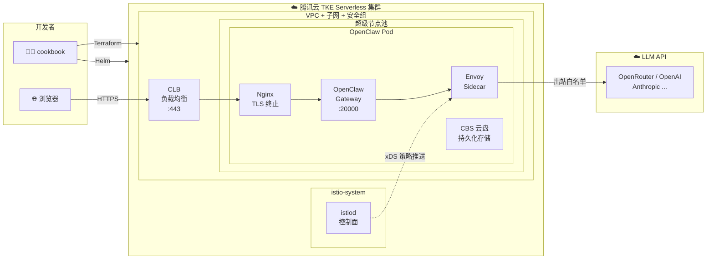

<p align="center">
  <h1 align="center">🦞 OpenClaw on TKE Serverless Cookbook</h1>
  <p align="center">
    <strong>在腾讯云 TKE Serverless 上一键部署 OpenClaw AI Agent</strong>
  </p>
  <p align="center">
    <a href="#-5-分钟快速体验">快速体验</a> ·
    <a href="#-架构总览">架构总览</a> ·
    <a href="#-部署模式">部署模式</a> ·
    <a href="#-常见问题">FAQ</a> ·
    <a href="./terraform/README.md">Terraform 文档</a> ·
    <a href="./charts/openclaw-cookbook/README.md">Helm Chart 文档</a>
  </p>
</p>

---

## 📖 这是什么？

这是一份 **开箱即用的部署指南（Cookbook）**，帮助你在 [腾讯云 TKE Serverless](https://cloud.tencent.com/product/tkeserverless) 上快速部署 [OpenClaw](https://github.com/openclaw)。

**你不需要是 Kubernetes 专家**，只需要按照本指南的步骤操作，就能在 5 分钟内完成从零到部署的全过程。

### 为什么选择 TKE Serverless？

| 特性 | 说明 |
|------|------|
| 🚫 **无需管理服务器** | 没有虚拟机、没有节点，所有计算资源按需自动分配 |
| 💰 **按需计费** | 只按 Pod 实际使用的 CPU/内存收费，空闲时零成本 |
| 🔒 **安全隔离** | 每个 Pod 运行在独立的轻量虚拟机中，天然安全隔离 |
| ⚡ **秒级扩缩容** | 无需预置节点，Pod 秒级启动 |
| 🛠️ **兼容标准 K8s** | 完全兼容标准 Kubernetes API，已有 K8s 经验可无缝迁移 |

### 本 Cookbook 提供了什么？

```
openclaw-on-tencentcloud-tke-serverless-cookbook/
├── terraform/                  # 🏗️ 基础设施即代码 — 一键创建腾讯云集群
│   ├── main.tf                 #    VPC + 子网 + 安全组 + TKE 集群 + 超级节点池
│   ├── variables.tf            #    可配置参数
│   ├── outputs.tf              #    输出（kubeconfig 等）
│   └── ...
└── charts/openclaw-cookbook/    # 📦 Helm Chart — 一键部署 OpenClaw 应用
    ├── templates/              #    K8s 资源模板（StatefulSet / Service / Istio 策略等）
    ├── values.yaml             #    标准配置（默认推荐，含 Istio 服务治理）
    ├── values-minimal.yaml     #    最简配置（仅基础工作负载）
    └── ...
```

---

## 🏗️ 架构总览



**两步部署**：

| 步骤 | 工具 | 做什么 | 耗时 |
|------|------|--------|------|
| **① 创建基础设施** | Terraform | 创建 VPC、子网、安全组、TKE 集群和超级节点池 | ~5-10 分钟 |
| **② 部署应用** | Helm | 部署 OpenClaw 网关及相关配置 | ~2-3 分钟 |

---

## 🚀 5 分钟快速体验

### 前置准备

在开始之前，请确保你的电脑上已安装以下工具：

| 工具 | 最低版本 | 安装指南 | 说明 |
|------|---------|---------|------|
| **Terraform** | >= 1.5.0 | [安装指南](https://developer.hashicorp.com/terraform/install) | 基础设施即代码工具 |
| **kubectl** | >= 1.28 | [安装指南](https://kubernetes.io/docs/tasks/tools/) | Kubernetes 命令行工具 |
| **Helm** | >= 3.x | [安装指南](https://helm.sh/docs/intro/install/) | Kubernetes 包管理器 |

另外你还需要：

- **腾讯云账号** — [注册地址](https://cloud.tencent.com/register)
- **API 密钥** — [获取地址](https://console.cloud.tencent.com/cam/capi)（用于 Terraform 创建云资源）
- **LLM API Key** — 至少一个，支持：
  - [OpenRouter API Key](https://openrouter.ai/keys)（推荐，聚合多家 LLM）
  - [OpenAI API Key](https://platform.openai.com/api-keys)
  - [Anthropic API Key](https://console.anthropic.com/settings/keys)
  - 或其他兼容 OpenAI API 的服务

> 💡 **新用户提示**：如果你还没有腾讯云账号，注册后通常有免费试用额度。

---

### 步骤一：克隆仓库

```bash
git clone https://github.com/tke-workshop/openclaw-on-tencentcloud-tke-serverless-cookbook.git
cd openclaw-on-tencentcloud-tke-serverless-cookbook
```

### 步骤二：创建 TKE 集群

```bash
# 1. 配置腾讯云凭证（不要把密钥写到文件里！）
export TENCENTCLOUD_SECRET_ID="AKIDxxxxxxxxxxxxxxxxxxxxxxxxxxxxxxxx"
export TENCENTCLOUD_SECRET_KEY="xxxxxxxxxxxxxxxxxxxxxxxxxxxxxxxx"

# 2. 进入 Terraform 目录
cd terraform

# 3. 初始化（首次运行需要下载 Provider，可能需要 1-2 分钟）
terraform init

# 4. 创建集群（约 5-10 分钟，请耐心等待）
terraform apply
# 输入 "yes" 确认创建
```

> 📋 **Terraform 会自动创建**：VPC → 子网 → 安全组 → TKE 集群 → 超级节点池 → 公网访问端点

### 步骤三：连接集群

```bash
# 导出 kubeconfig
terraform output -raw kubeconfig > ~/.kube/config-openclaw
export KUBECONFIG=~/.kube/config-openclaw

# 验证连接（应该能看到超级节点）
kubectl get nodes
```

如果看到类似以下输出，说明集群已就绪：

```
NAME                    STATUS   ROLES   AGE   VERSION
eklet-subnet-xxxxxxx   Ready    agent   1m    v1.34.1-eks.1
```

### 步骤四：部署 OpenClaw

```bash
# 回到项目根目录
cd ..

# 部署（以 OpenAI 为例，替换为你的真实 Key）
helm install cookbook ./charts/openclaw-cookbook/ \
  -f ./charts/openclaw-cookbook/values-minimal.yaml \
  --namespace openclaw --create-namespace \
  --set provider.name=openai \
  --set provider.baseUrl=https://api.openai.com/v1 \
  --set secrets.env.API_KEY=sk-proj-xxx \
  --set provider.defaultModel=gpt-4o \
  --set gateway.authToken=your-gateway-token 

# 等待 Pod 就绪（通常 1-2 分钟）
kubectl wait --for=condition=Ready pod -l app.kubernetes.io/instance=cookbook \
  -n openclaw --timeout=180s
```

> 💡 更多 Provider 示例见 [Helm Chart README](./charts/openclaw-cookbook/README.md)。

### 步骤五：访问 OpenClaw

```bash
echo "https://$(kubectl get svc -n openclaw --field-selector spec.type=LoadBalancer \
  -o jsonpath='{.items[0].status.loadBalancer.ingress[0].ip}')"
```

在浏览器中打开输出的地址（自签名证书，需点击"继续访问"），
输入你部署时设置的登录密码即可连接。

### 🎉 完成！

你的 OpenClaw AI Agent 网关已经在腾讯云 TKE Serverless 上运行了！

---

## ⚠️ 重要：体验结束后务必清理资源

**TKE Serverless 是按量计费的**，体验完成后请务必销毁资源，避免持续产生费用：

```bash
# 1. 卸载应用
helm uninstall cookbook -n openclaw

# 2. 清理 PVC（存储卷不会自动删除）
kubectl delete pvc -n openclaw -l app.kubernetes.io/instance=cookbook

# 3. 销毁所有云资源
cd terraform
terraform destroy
# 输入 "yes" 确认销毁
```

> 💡 如果你只是暂时离开，不销毁集群本身是可以的 —— **超级节点池在没有 Pod 运行时不产生费用**，只有 TKE 集群管理费和 CLB 会有少量成本。

---

## 📋 部署模式

本 Cookbook 提供两种预设配置，适合不同场景：

### 🟣 标准模式 — 默认推荐

```bash
helm install cookbook ./charts/openclaw-cookbook/ \
  --namespace openclaw --create-namespace \
  --set secrets.existingSecret=openclaw-secrets
```

| 特性 | 状态 |
|------|------|
| OpenClaw 网关 | ✅ 启用 |
| Nginx HTTPS 反向代理 | ✅ 启用（自签名证书，自动 TLS 终止） |
| 安全加固 | ✅ 启用 |
| Istio 服务网格（自动安装） | ✅ 启用 |
| 出站白名单（仅允许访问指定 LLM API） | ✅ 启用 |
| 熔断保护（防止 LLM API 异常雪崩） | ✅ 启用 |

> 💡 标准模式适合生产环境，提供完整的网络治理能力。Istio 控制面会通过 pre-install hook 自动安装。

### 🟢 最简模式 — 个人体验

```bash
helm install cookbook ./charts/openclaw-cookbook/ \
  -f ./charts/openclaw-cookbook/values-minimal.yaml \
  --namespace openclaw \
  --set secrets.existingSecret=openclaw-secrets
```

| 特性 | 状态 |
|------|------|
| OpenClaw 网关 | ✅ 启用 |
| Nginx HTTPS 反向代理 | ✅ 启用（自签名证书，自动 TLS 终止） |
| 安全加固（非 root 运行） | ✅ 启用 |
| EIP 公网 IP | ✅ 启用 |
| 镜像缓存 | ❌ 关闭 |
| 数据持久化 | ❌ 关闭 |
| Istio 服务治理 | ❌ 关闭 |

> 💡 最简模式关闭了 Istio 和数据持久化等高级功能，但仍然通过公网 HTTPS 直接访问，适合快速体验。

---

## 💰 费用说明

| 资源 | 说明 | 预估费用 |
|------|------|---------|
| TKE 托管集群 | 集群管理 | 免费 |
| 超级节点池 | **无 Pod 运行时不计费** | 按 CPU/内存实际用量 |
| VPC + 子网 | 网络基础设施 | 免费 |
| 安全组 | 网络策略 | 免费 |
| CLB 负载均衡 | 部署应用后创建 | ~0.02 元/小时 |
| EIP 弹性公网 IP | 默认模式启用 | 按流量计费 |
| CBS 云硬盘 | 10Gi SSD | ~0.003 元/小时 |

> 💡 **个人体验**建议使用最简模式，体验完毕后立即销毁资源，几乎不会产生费用。

---

## 🔧 自定义配置

### Terraform 参数

复制示例配置文件并按需修改：

```bash
cd terraform
cp terraform.tfvars.example terraform.tfvars
# 编辑 terraform.tfvars
```

| 参数 | 默认值 | 说明 |
|------|--------|------|
| `region` | `ap-guangzhou` | 腾讯云区域 |
| `availability_zone` | `ap-guangzhou-6` | 可用区 |
| `cluster_name` | `openclaw-cookbook` | 集群名称前缀 |
| `cluster_version` | `1.34.1` | Kubernetes 版本 |
| `cookbook_service_port` | `31234` | 服务端口 |

完整参数说明见 [terraform/README.md](./terraform/README.md)。

### Helm Chart 参数

| 参数 | 默认值 | 说明 |
|------|--------|------|
| `image.tag` | `latest` | 镜像版本 |
| `eip.enabled` | `true` | 是否绑定公网 EIP |
| `service.type` | `LoadBalancer` | Service 类型 |
| `nginx.enabled` | `true` | 启用 Nginx HTTPS 反向代理 sidecar |
| `nginx.tls.autoGenerate` | `true` | 自动生成自签名证书 |
| `nginx.tls.existingSecret` | `""` | 引用已有 TLS Secret（生产环境推荐） |
| `gateway.authToken` | `""` | Gateway 登录 Token（为空时自动生成随机值） |
| `storage.size` | `10Gi` | 持久化存储大小 |
| `resources.limits.cpu` | `2` | CPU 上限 |
| `resources.limits.memory` | `2Gi` | 内存上限 |
| `istio.enabled` | `false` | 启用 Istio 服务治理 |
| `istio.install.enabled` | `false` | 自动安装 Istio 控制面 |

完整参数说明见 [charts/openclaw-cookbook/README.md](./charts/openclaw-cookbook/README.md)。

---

## ❓ 常见问题

<details>
<summary><strong>Q: 什么是 TKE Serverless？和普通 Kubernetes 有什么区别？</strong></summary>

TKE Serverless 是腾讯云提供的无服务器 Kubernetes 服务。和传统 K8s 最大的区别是：

- **传统 K8s**：你需要自己创建和管理工作节点（虚拟机），然后在上面运行 Pod
- **TKE Serverless**：没有节点的概念，你只需要定义 Pod，腾讯云自动分配计算资源

通俗来说，就像云函数（Serverless Function）升级版 —— 你不用管底层服务器，但比云函数更灵活，可以运行任意容器。
</details>

<details>
<summary><strong>Q: 什么是"超级节点池"？</strong></summary>

超级节点池是 TKE Serverless 的核心概念。它是一个"虚拟的"节点池：

- 没有真实的虚拟机
- Pod 调度到超级节点池后，腾讯云自动创建一个轻量沙箱来运行它
- 每个 Pod 拥有独立的网络栈和安全隔离
- 按 Pod 实际使用的 CPU/内存计费，不使用时不花钱

本 Cookbook 创建了两个可用区（广州6区和7区）的超级节点池，提供高可用性。
</details>

<details>
<summary><strong>Q: Terraform 是什么？我一定要用它吗？</strong></summary>

Terraform 是一个基础设施即代码（IaC）工具，可以让你通过配置文件来创建和管理云资源，而不是在控制台上手动点击。

**你不一定要用 Terraform**。你也可以在 [腾讯云 TKE 控制台](https://console.cloud.tencent.com/tke2) 手动创建集群，只需确保：
- 集群类型为「标准集群」+「超级节点池」
- 网络模式为 VPC-CNI
- 获取 kubeconfig 并配置好 kubectl

但我们推荐使用 Terraform，因为它可以**一键创建所有资源，也可以一键销毁**，避免遗漏资源导致持续计费。
</details>

<details>
<summary><strong>Q: Helm 是什么？</strong></summary>

Helm 是 Kubernetes 的包管理器，类似于 Linux 的 apt/yum 或 macOS 的 Homebrew。

在本项目中，Helm Chart 把 OpenClaw 需要的所有 Kubernetes 资源（容器、网络、存储、配置等）打包在一起，一条命令就能完成部署。你不需要手动创建一堆 YAML 文件。
</details>

<details>
<summary><strong>Q: Istio 是什么？我需要它吗？</strong></summary>

Istio 是一个服务网格（Service Mesh）框架，可以在不修改应用代码的情况下，为你的服务添加：
- 出站流量控制（白名单，只允许访问指定的 LLM API）
- 熔断保护（某个 LLM API 异常时自动切断，防止雪崩）
- 流量监控和日志

**个人用户**：不需要 Istio，使用默认模式或最简模式即可。

**企业用户**：如果你需要控制 AI Agent 能访问哪些外部 API、需要审计日志，建议启用 Istio（标准企业模式）。
</details>

<details>
<summary><strong>Q: terraform apply 报错怎么办？</strong></summary>

常见错误及解决方法：

1. **认证失败** — 检查 `TENCENTCLOUD_SECRET_ID` 和 `TENCENTCLOUD_SECRET_KEY` 是否正确设置
2. **配额不足** — 腾讯云新账号可能有资源配额限制，可在控制台申请提升
3. **区域不支持** — 确认所选区域支持 TKE Serverless（推荐使用默认的 `ap-guangzhou`）
4. **网络超时** — 重新运行 `terraform apply`，Terraform 支持断点续传
</details>

<details>
<summary><strong>Q: Pod 一直处于 Pending 状态怎么办？</strong></summary>

```bash
# 查看 Pod 事件
kubectl describe pod <pod-name> -n openclaw
```

常见原因：
1. **安全组未就绪** — 等待 1-2 分钟后重试
2. **子网 IP 不足** — 检查子网 CIDR 是否有足够的可用 IP
3. **镜像拉取失败** — 检查镜像仓库凭证是否正确配置
</details>

<details>
<summary><strong>Q: 如何访问部署好的 OpenClaw？</strong></summary>

```bash
echo "https://$(kubectl get svc -n openclaw --field-selector spec.type=LoadBalancer \
  -o jsonpath='{.items[0].status.loadBalancer.ingress[0].ip}')"
```

在浏览器中打开输出的地址，输入你部署时设置的登录密码即可连接。

> ⚠️ 默认使用自签名证书，浏览器会提示"不安全"，点击"继续访问"即可。
> 生产环境建议通过 `nginx.tls.existingSecret` 配置正式证书。

</details>

---

## 📚 文档索引

| 文档 | 说明 |
|------|------|
| [terraform/README.md](./terraform/README.md) | Terraform 基础设施详细文档 |
| [charts/openclaw-cookbook/README.md](./charts/openclaw-cookbook/README.md) | Helm Chart 详细文档 |
| [charts/openclaw-cookbook/values.yaml](./charts/openclaw-cookbook/values.yaml) | 标准配置（默认推荐） |
| [charts/openclaw-cookbook/values-minimal.yaml](./charts/openclaw-cookbook/values-minimal.yaml) | 最简配置 |

---

## 🤝 贡献

欢迎提交 Issue 和 Pull Request！

---

## 📄 许可证

本项目采用 [Apache License 2.0](./LICENSE) 开源。
